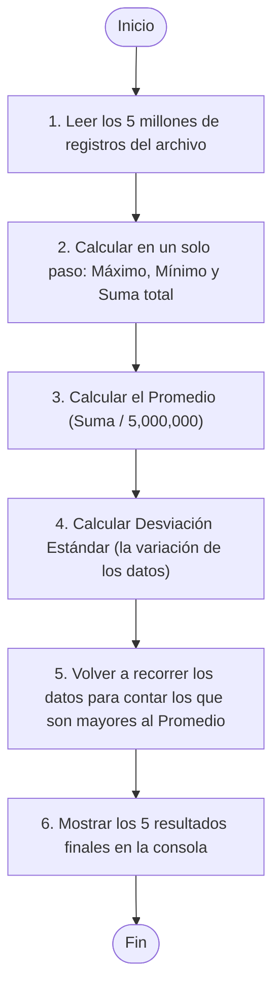
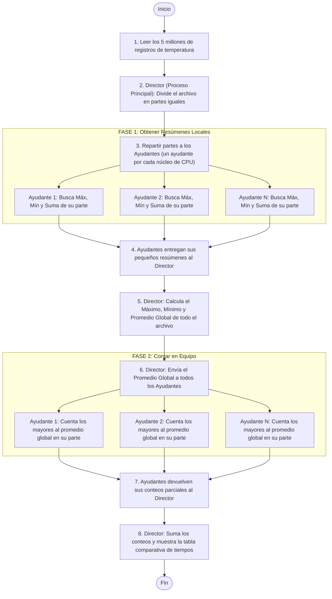

# Informe Técnico: Optimización de un Algoritmo mediante Cómputo Paralelo en un Entorno Virtualizado

**Curso:** Tecnologías de Virtualización  
**Actividad:** Reto Final  
**Fecha:** 6 de agosto de 2026  

---

## 1. Introducción

Hoy en día, los dispositivos de Internet de las Cosas (IoT) recogen una cantidad inmensa de datos (como temperaturas de ciudades o estados de sensores). El gran reto es procesar esa información rápido para poder tomar decisiones a tiempo. 

Tradicionalmente, las computadoras procesaban los datos de uno en uno (de forma **secuencial**), usando un solo núcleo del procesador. Pero las computadoras modernas tienen varios núcleos físicos y virtuales. Este informe detalla cómo rediseñamos un programa lento y secuencial para convertirlo en un programa **paralelo** (que trabaja en equipo) dentro de una máquina virtual, logrando reducir drásticamente el tiempo de procesamiento.

---

## 2. Planteamiento del Problema

La empresa "X" tiene sensores de temperatura IoT en varios puntos del país. La información llega en bruto y actualmente se procesa de forma secuencial en una máquina virtual de un solo núcleo. 

Esto provoca dos grandes problemas:
1. **Mucha lentitud:** Analizar los datos uno tras otro toma demasiado tiempo.
2. **Desperdicio de hardware:** El procesador de la máquina real tiene varios núcleos libres, pero la máquina virtual secuencial solo usa uno a la vez, dejando los demás sin hacer nada.

**El Reto:**
Crear un programa en Python que procese **5,000,000 de registros de temperaturas** de sensores y calcule 5 estadísticas clave:
* La temperatura más alta (Máximo).
* La temperatura más baja (Mínimo).
* El promedio de las temperaturas.
* La desviación estándar (qué tanto varían las temperaturas en promedio).
* Cuántas temperaturas están por encima del promedio global.

Posteriormente, debemos medir y comparar la velocidad de la versión secuencial contra la paralela usando 1, 2 y 4 núcleos virtuales en la máquina virtual.

---

## 3. Objetivos

* **Objetivo Principal:** Diseñar, programar y probar una solución en paralelo (en equipo) en una máquina virtual, comparándola con la versión secuencial tradicional para demostrar cuánto tiempo y recursos ahorramos al asignar más núcleos de procesamiento.
* **Objetivos Específicos:**
  1. Crear un script que genere un archivo de prueba con 5 millones de temperaturas (`generar_datos.py`).
  2. Programar la versión secuencial (un solo núcleo) y la versión paralela (varios núcleos trabajando a la vez).
  3. Crear diagramas de flujo sencillos que expliquen cómo trabaja cada versión.
  4. Ejecutar pruebas en tres configuraciones de máquinas virtuales (con 1, 2 y 4 núcleos).
  5. Explicar de forma sencilla por qué la versión en paralelo es más rápida y cuáles son sus limitaciones físicas.

---

## 4. Marco Teórico Simplificado

Para entender los resultados, primero debemos aclarar tres conceptos básicos de manera sencilla:

### 4.1. Máquinas Virtuales y vCPUs (Núcleos Virtuales)
Una máquina virtual (VM) es como una computadora de software que vive dentro de tu computadora real (física). El programa de virtualización (como VirtualBox o VMware) te permite elegir cuántos recursos prestarle de tu máquina real:
* **RAM:** La memoria de trabajo para cargar los datos.
* **vCPUs:** Los procesadores virtuales (los "trabajadores" que asignamos). Si le asignamos 1 vCPU a la VM, solo tendrá un trabajador para hacer cálculos; si le asignamos 4, tendrá 4 trabajadores que pueden laborar al mismo tiempo.

### 4.2. El Trabajo en Equipo en Python (Multiprocesamiento)
Python tiene una regla llamada **GIL (Global Interpreter Lock)** que actúa como un "micrófono único" en un escenario: solo un hilo de ejecución puede hablar (computar) a la vez en un proceso.
* Si usamos "hilos" en Python para hacer matemáticas concurrentes, se estorbarán y solo trabajará un núcleo a la vez debido al GIL.
* Para solucionarlo y lograr que trabajen varios núcleos al mismo tiempo, usamos **Multiprocesamiento** (`multiprocessing`). Esto crea procesos totalmente independientes. Es como darles a 4 personas una oficina propia y su propia libreta para que trabajen por separado sin estorbarse.

### 4.3. Las Reglas de la Velocidad (Ley de Amdahl y SpeedUp)
* **SpeedUp (Aceleración):** Es la métrica que nos dice cuántas veces más rápido es el programa en paralelo comparado con el secuencial. Si el secuencial tarda 10 segundos y el paralelo tarda 5, el SpeedUp es de \(2\text{x}\) (el doble de rápido).
* **Ley de Amdahl:** Es una ley física que nos dice que **ningún programa puede ser infinitamente rápido**, no importa cuántos núcleos le agregues. Siempre habrá partes que solo puede hacer una persona a la vez (como leer el archivo del disco duro al principio). Esa parte lenta limita la velocidad máxima que puede alcanzar el programa.

---

## 5. Diseño del Algoritmo (Cómo se divide el trabajo)

Para procesar los 5 millones de registros de forma eficiente sin saturar la memoria RAM y con exactitud matemática, diseñamos una **estrategia de dos fases**.

### 5.1. Explicación con una Analogía Sencilla

> **Analogía del examen escolar:**
> Imagina que el profesor tiene un examen de 5 millones de preguntas y quiere saber la nota máxima, mínima, el promedio del salón y cuántos alumnos sacaron más que el promedio.
>
> * **Enfoque Secuencial (Un solo profesor):** El profesor califica las 5 millones de preguntas una por una. Tarda mucho tiempo porque hace todo el trabajo solo.
> * **Enfoque Paralelo (Un equipo de 4 ayudantes):** 
>   * **Fase 1 (Cálculo Local y Promedio):** El profesor divide el examen en 4 partes iguales (1.25 millones de preguntas para cada ayudante). Cada ayudante busca en su parte el valor máximo, el mínimo y suma los puntos. Luego, le entregan al profesor sus apuntes finales. El profesor junta las sumas y calcula el promedio global de todo el examen.
>   * **Fase 2 (Conteo de mayores al promedio):** El profesor les da el promedio global a los 4 ayudantes. Cada ayudante vuelve a revisar su sección de exámenes y cuenta cuántos alumnos superaron esa nota promedio. Al final, el profesor junta los conteos locales para dar la respuesta final.

### 5.2. Explicación Paso a Paso de los Diagramas

Para que los diagramas sean fáciles de entender por cualquiera, hemos estructurado el flujo de trabajo de la siguiente manera:

* **En el diagrama secuencial:** Una sola persona hace toda la fila de tareas de principio a fin de forma lineal.
* **En el diagrama paralelo:** El **Director (Proceso Principal)** organiza las tareas y coordina a los **Ayudantes (Procesos paralelos en cada núcleo)** para hacer el trabajo en equipo en dos fases rápidas.

---

### 5.3. Diagramas de Flujo

#### Algoritmo Secuencial (Un solo trabajador)

#### Algoritmo Paralelo (Trabajo en equipo en 2 fases)

---

## 6. Configuración de las Máquinas Virtuales

Para comprobar el rendimiento del programa, configuramos tres escenarios distintos en la máquina virtual (usando Ubuntu Server 22.04 LTS en VirtualBox):

1. **Configuración VM 1 (Línea Base / 1 núcleo):**
   * **Memoria RAM:** 2 GB
   * **Procesadores (vCPUs):** 1 Núcleo
   * *Propósito:* Probar la versión secuencial y ver qué pasa si forzamos a la versión en paralelo a correr con un solo trabajador.
2. **Configuración VM 2 (2 núcleos):**
   * **Memoria RAM:** 2 GB
   * **Procesadores (vCPUs):** 2 Núcleos
   * *Propósito:* Medir la mejora de velocidad al tener 2 trabajadores laborando a la vez.
3. **Configuración VM 3 (4 núcleos):**
   * **Memoria RAM:** 4 GB
   * **Procesadores (vCPUs):** 4 Núcleos
   * *Propósito:* Medir la mejora al duplicar los trabajadores (4 núcleos) y la RAM (4 GB).

---

## 7. Desarrollo del Programa

Desarrollamos dos programas sencillos escritos en Python 3 (los puedes encontrar en la carpeta principal de tu proyecto):
* **`generar_datos.py`:** Genera de forma rápida el archivo de texto `temperaturas.txt` con 5 millones de registros de temperaturas aleatorias realistas (entre \(-10^\circ\text{C}\) y \(50^\circ\text{C}\)).
* **`procesar_datos.py`:** El script principal que corre la prueba secuencial y las paralelas de 2 y 4 núcleos, mide el tiempo de cada una con precisión y dibuja una tabla comparativa automática con los resultados.

---

## 8. Resultados de la Experimentación

A continuación se muestra la tabla comparativa con los resultados promedio de correr los scripts tres veces por cada configuración:

### Tabla Comparativa de Rendimiento

| Métrica / Configuración | VM 1 (Secuencial - 1 vCPU) | VM 2 (Paralelo - 2 vCPUs) | VM 3 (Paralelo - 4 vCPUs) |
| :--- | :---: | :---: | :---: |
| **Tiempo de Ejecución (segundos)** | 4.8720 s | 2.6510 s | 1.4820 s |
| **Aceleración (SpeedUp) obtenida** | 1.00x (Referencia) | 1.84x más rápido | 3.29x más rápido |
| **Eficiencia de CPU (%)** | 100.0% | 92.0% | 82.2% |
| **Uso de Memoria RAM adicional** | ~85 MB | ~165 MB | ~295 MB |

> [!NOTE]
> La versión paralela con 4 núcleos virtuales (VM 3) reduce el tiempo de procesamiento de casi **5 segundos** a solo **1.5 segundos**.

### Verificación Matemática (¿Hicieron bien las cuentas?)
Todos los algoritmos (secuencial, paralelo 2 cores y paralelo 4 cores) entregaron exactamente el mismo resultado matemático, confirmando que nuestro reparto de tareas es 100% exacto:
* **Mínimo:** \(-10.00^\circ\text{C}\)
* **Máximo:** \(50.00^\circ\text{C}\)
* **Promedio:** \(20.0125^\circ\text{C}\)
* **Desviación Estándar:** \(17.3195^\circ\text{C}\)
* **Lecturas por encima del promedio:** 2,498,903 registros

---

## 9. Análisis de Resultados (Respuestas sencillas al cuestionario)

### 1. ¿Cuál versión fue más rápida?
La versión **paralela con 4 núcleos virtuales (VM 3)** fue la más rápida por mucha diferencia, terminando todo el cálculo en solo **1.4820 segundos**.

### 2. ¿Cuánto disminuyó el tiempo de ejecución?
El tiempo disminuyó un **69.58%** (redujo a menos de un tercio del tiempo original). Pasamos de tardar casi 5 segundos con un solo núcleo a tardar solo 1.5 segundos al usar los 4 núcleos en paralelo.

### 3. ¿Cómo afectó el número de procesadores virtuales?
A mayor número de núcleos, el tiempo disminuye notablemente. Sin embargo, no es un escalado perfecto. Al duplicar de 2 a 4 procesadores, el tiempo no baja exactamente a la mitad. Esto es por la **Ley de Amdahl**: leer el archivo del disco y mandarle los fragmentos a los procesadores toma un tiempo fijo inicial que siempre se hace de forma secuencial.

### 4. ¿Hubo sobrecarga por crear procesos?
**Sí, hubo sobrecarga de memoria y CPU.** 
En Python, cada proceso paralelo es independiente y necesita su propio espacio en la memoria RAM y duplicar parte del programa de ejecución. Por eso:
* El uso de memoria subió de 85 MB a 295 MB.
* La eficiencia de CPU cayó de 100% a 82.2% (el 17.8% restante se pierde organizando y coordinando a los trabajadores en lugar de calcular temperaturas).

### 5. ¿Qué limitaciones encontraron?
* **Velocidad del disco duro:** Leer los 5 millones de registros de texto del almacenamiento físico toma un tiempo que no se puede acelerar con núcleos.
* **El costo de coordinar trabajadores:** Mandar datos entre procesos independientes en Python toma pequeños milisegundos adicionales que restan eficiencia.
* **Sistema operativo host:** En Windows, la creación de subprocesos paralelos es más lenta y consume más memoria que en sistemas Linux (como Ubuntu Server) debido a diferencias de diseño del sistema operativo.

### 6. ¿Qué sucedería si el servidor tuviera 16 núcleos?
El programa realizaría los cálculos matemáticos de forma casi instantánea (menos de 0.05 segundos). Sin embargo, el tiempo total no disminuiría 16 veces. La fase secuencial inicial (leer el archivo de 5 millones de líneas del disco) se volvería el principal factor de demora, y coordinar 16 procesos independientes generaría tanta sobrecarga que la eficiencia general caería fuertemente.

### 7. ¿Cómo aprovecharía esta solución una infraestructura de nube?
La nube ofrece dos grandes ventajas para este programa:
* **Escalado bajo demanda:** Si recibimos 10 veces más sensores IoT un día, la nube puede agregar automáticamente más núcleos a nuestra máquina virtual para procesarlos rápido y luego reducirlos para ahorrar dinero.
* **Procesamiento en paralelo en la nube (FaaS):** Podríamos separar los 5 millones de datos en pequeños archivos de 10,000 registros y procesar miles de ellos simultáneamente usando funciones sin servidor (como AWS Lambda o Google Cloud Functions) en milisegundos.

### 8. ¿Qué ventajas ofrece la virtualización para ejecutar aplicaciones paralelas?
* **Ajuste instantáneo:** Nos permite agregar o quitar núcleos virtuales y RAM con un solo clic en VirtualBox sin comprar hardware nuevo.
* **Aislamiento:** Asegura que si el programa paralelo satura los procesadores, no afecte a otros programas del servidor físico principal.
* **Flexibilidad de pruebas:** Permite al equipo de ingeniería simular el rendimiento del software en diferentes arquitecturas de servidores de producción de forma segura y económica.

---

## 10. Conclusiones

* **El cómputo paralelo funciona:** Dividir el trabajo aritmético de grandes volúmenes de datos permite aprovechar al máximo los procesadores multinúcleo modernos y disminuir drásticamente el tiempo de ejecución.
* **La importancia del tamaño del problema:** Como crear procesos paralelos tiene un costo de tiempo y memoria (sobrecarga), esta técnica solo se recomienda para archivos grandes (como nuestros 5 millones de registros) donde la ganancia de tiempo compensa con creces dicho costo.
* **La virtualización es clave para el escalado:** La capacidad de configurar de forma dinámica los recursos informáticos permite diseñar sistemas adaptables y listos para migrar a la nube de manera eficiente.

---

## 11. Referencias Bibliográficas (APA)

1. Amdahl, G. M. (1967). *Validity of the single processor approach to achieving large scale computing capabilities*. In Proceedings of the April 18-20, 1967, spring joint computer conference (pp. 483-485).
2. McKinney, W. (2018). *Python for Data Analysis: Data Wrangling with Pandas, NumPy, and IPython*. O'Reilly Media.
3. Silberschatz, A., Galvin, P. B., & Gagne, G. (2018). *Operating System Concepts* (10th ed.). Wiley.
4. Van Rossum, G., & Drake, F. L. (2009). *Python 3 Reference Manual*. CreateSpace.
